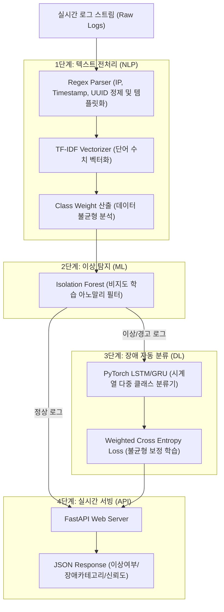

# LogSentinel

> **비지도 학습 및 딥러닝 기법을 활용한 백엔드 시스템 로그 실시간 장애 예방 파이프라인**

LogSentinel은 분산 서버 인프라에서 발생하는 방대한 양의 로그 스트림을 실시간으로 감시하고, 장애의 전조 증상(이상 로그)을 비지도 학습으로 탐지하여, 딥러닝(LSTM)을 통해 실시간 장애 등급을 사전에 분류/경보하는 지능형 모니터링 파이프라인 솔루션입니다.

---

## 🚀 Key Features

1. **실시간 NLP 로그 정제 및 벡터화**:
   - Regex 기반의 파싱 기술을 적용해 IP, UUID, Timestamp 등 분석 노이즈를 제거 및 템플릿화합니다.
   - 정제된 로그 텍스트를 TF-IDF(Term Frequency-Inverse Document Frequency)를 통해 고차원의 수치형 벡터(500차원)로 실시간 변환합니다.

2. **비지도 학습(ML) 기반 Anomaly 1차 필터링**:
   - 대규모 로그 스트림에서 사전 라벨이 없는 원시 로그의 정상/이탈 상태를 **Isolation Forest** 알고리즘으로 즉각(1차) 스크리닝합니다.
   - Decision Score를 계산하여 최적 임계치(`Threshold = 0.210`) 미만일 경우 이상 징후로 격리 판정합니다.

3. **시계열 딥러닝(DL) 기반 에러 다중 분류**:
   - 이상 징후로 판정된 로그에 대해, 최근 5개 로그 시퀀스의 흐름 맥락(Context Sequence)을 **PyTorch LSTM** 순환 신경망으로 심층 분석합니다.
   - 최종 장애 수준(ALERT, FATAL, WARNING)을 다중 분류하여 관리자에게 통보합니다.
   - 현업 로그의 고질적 문제인 데이터 불균형(Class Imbalance) 문제를 **Weighted Cross Entropy Loss**로 보완하여 신뢰성을 극대화했습니다.

4. **FastAPI 기반 실시간 예측 서버 & 외부 터널링**:
   - FastAPI 엔진을 구동하여 실시간 JSON 입출력을 초고속 서빙합니다.
   - `localtunnel`을 자동 연동하여, 외부 클라이언트나 발표 현장의 청중이 퍼블릭 URL을 통해 서버의 Swagger UI에 접속하여 직접 데모 테스트를 해볼 수 있습니다.

---

## 📂 Project Directory Structure

```text
git_for_submit/
├── notebooks/             # AI 모델링 연구 및 분석을 위한 Jupyter Notebooks
│   ├── 01_eda_preprocessing.ipynb     # 데이터 탐색 및 정규식 정제, TF-IDF 변환 설계
│   ├── 02_anomaly_detection.ipynb    # Isolation Forest 이상 탐지 및 임계치 튜닝
│   └── 03_deep_learning_model.ipynb   # LSTM 모델 훈련 및 Weighted CE Loss 보정
├── src/                   # FastAPI 구동 및 핵심 추론 엔진 모듈
│   ├── classifier.py      # PyTorch LSTM Classifier 모델 구조 정의
│   ├── detector.py        # Isolation Forest Anomaly Detector 래퍼 클래스
│   ├── parser.py          # 정규식 기반 로그 파서 및 TF-IDF Vectorizer 로더
│   ├── main.py            # FastAPI 라우팅 엔드포인트 및 실시간 시퀀스 버퍼 제어
│   └── test_client.py     # 서버 검증용 모의 실시간 스트림 푸시 클라이언트
├── models/                # 즉시 실행 가능한 사전 학습 모델 가중치 (Pretrained Weights)
│   ├── vectorizer.pkl             # TF-IDF 단어 사전 및 피처 벡터라이저
│   ├── iso_forest_optimized.pkl   # 최적화된 Isolation Forest ML 가중치
│   └── lstm_model.pth             # PyTorch LSTM DL 신경망 가중치
├── data/
│   └── raw/
│       └── BGL_2k.log     # 신속한 동작 검증용 Blue Gene/L 로그 샘플 (2,000행)
├── requirements.txt       # 의존성 패키지 정의서
├── banner.txt             # 스프링 부트 스타일 기동 배너 텍스트
├── setup_env.sh           # 로컬 가상환경(.venv) 셋업 및 의존성 원클릭 설치 스크립트
├── run_server.sh          # 배너 출력 + localtunnel 외부 연동 + FastAPI 기동 스크립트
└── run_client.sh          # 가상환경 감지 후 src/test_client.py 실행 스크립트
```

---

## 프로젝트 아키텍처 및 데이터 흐름



---

## 🛠️ Installation & Setup (빠른 실행 방법)

본 프로젝트는 의존성 라이브러리가 로컬 가상환경에 격리되어 안전하게 설치되도록 자동화 셋업 스크립트를 제공합니다.

### 1. 가상환경 및 패키지 설치
터미널에서 아래 명령을 실행하면 파이썬 가상환경(`.venv`)을 생성하고 `requirements.txt`에 명시된 필수 패키지(PyTorch, Scikit-Learn 등)를 자동으로 설치합니다.
```bash
./setup_env.sh
```

### 2. FastAPI 백엔드 서버 구동
서버 기동 스크립트를 실행하면 스프링 부트 스타일의 예쁜 콘솔 배너와 함께 로컬 Swagger 주소 및 외부 테스트가 가능한 **Public Demo URL**이 화면에 바로 출력됩니다.
```bash
./run_server.sh
```
*기동 완료 시 콘솔 예시:*
```text
=========================================================================
  * Local Swagger UI : http://127.0.0.1:8000/docs
  * Public Demo URL  : https://xxxx-xxxx-xxxx.loca.lt/docs
=========================================================================
```

### 3. 모의 클라이언트 추론 검증
서버가 켜진 상태에서 다른 터미널 창을 열어 아래 명령을 실행하면, `data/raw/BGL_2k.log`에서 실시간 로그 스트림을 모방하여 서버로 배치식 요청을 보내고 정상/장애 레벨 판정 결과를 화면에 출력합니다.
```bash
./run_client.sh
```

---

## 🔍 Swagger UI를 활용한 수동 데모 테스트 안내 (초보자용 가이드)

FastAPI의 자동 대화형 문서(Swagger UI)를 이용하면 웹 브라우저 상에서 간편하게 API를 테스트해 볼 수 있습니다.

### 테스트 진행 순서

1. 서버 구동 콘솔에 표시된 **Local Swagger UI (`http://127.0.0.1:8000/docs`)** 또는 **Public Demo URL**에 접속합니다.
2. `POST /predict` 엔드포인트를 찾아 클릭한 후, 우측의 **[Try it out]** 버튼을 누릅니다.
3. 아래의 입력 창(`Request body`)에 JSON 형태로 로그 메시지를 작성하여 입력합니다.

#### 💡 실제 로그를 복사하여 테스트해 보는 방법 (추천)
> 테스트에 사용할 실제 상용 시스템 로그는 GitHub에 공개된 공식 BGL(Blue Gene/L Supercomputer) 로그 저장소에서 한 줄 단위로 복사해 올 수 있습니다.

1. **[BGL 공식 2k 로그 저장소 (GitHub RAW)](https://raw.githubusercontent.com/logpai/loghub/master/BGL/BGL_2k.log)**에 접속합니다.
2. 화면에 나열된 로그 중 마음에 드는 행을 하나 골라 **마우스 드래그로 복사(Ctrl+C)** 합니다.
   * *정상 로그 예시:*
     `- 1117838570 2005.06.03 R02-M1-N0-C:J12-U11 2005-06-03-15.42.50.675896 R02-M1-N0-C:J12-U11 DISCOVERY info active monitoring enabled`
   * *장애(Anomaly) 로그 예시:*
     `- 1118536830 2005.06.11 R30-M0-N9-C:J16-U01 2005-06-11-17.40.30.041344 R30-M0-N9-C:J16-U01 DISCOVERY error status 0x00000003, kernel panic`
3. Swagger UI의 `logs` 입력 칸에 복사한 문자열을 따옴표 안에 붙여넣습니다.
4. **[Execute]** 버튼을 누르면, 하단의 `Responses` 창에서 **비지도 학습 이상치 탐지 여부(`is_anomaly`)**, **딥러닝 등급 판정 결과(`classification`)**, 그리고 **예측 신뢰도(`confidence`)**를 즉시 확인해 볼 수 있습니다.

#### Request Body (JSON 예시)
```json
{
  "logs": [
    "- 1118536830 2005.06.11 R30-M0-N9-C:J16-U01 2005-06-11-17.40.30.041344 R30-M0-N9-C:J16-U01 DISCOVERY error status 0x00000003, kernel panic"
  ]
}
```

#### Response Body (JSON 반환 예시)
```json
{
  "results": [
    {
      "log": "- 1118536830 2005.06.11 R30-M0-N9-C:J16-U01 2005-06-11-17.40.30.041344 R30-M0-N9-C:J16-U01 DISCOVERY error status 0x00000003, kernel panic",
      "is_anomaly": true,
      "classification": "FATAL",
      "confidence": 0.9412
    }
  ]
}
```

---

## 🏆 Model Training & Pipeline Architecture

모델의 정교한 매개변수 설정이나 대용량 데이터셋(470만 행)을 활용한 상세한 파이프라인 학습 과정은 `notebooks/` 디렉토리 내의 주피터 노트북에 아주 상세히 기술되어 있습니다.

- **`01_eda_preprocessing.ipynb`**: 원시 로그 통계 분석 및 정규 표현식 전처리 룰 확립
- **`02_anomaly_detection.ipynb`**: Isolation Forest의 오염도(`contamination`) 조정 및 Decision Score 임계치 결정
- **`03_deep_learning_model.ipynb`**: 시퀀스 LSTM 구현, 클래스 불균형에 대응하는 가중치 산출 및 손실함수 적용 검증

---

## 📊 Data Sources & References

본 실습에 사용된 시스템 로그 데이터셋의 출처 및 정보는 다음과 같습니다.

* **자료명**: **BGL (Blue Gene/L Supercomputer System Log) Dataset**
  - 미국 로렌스 리버모어 국립연구소(LLNL)의 Blue Gene/L 슈퍼컴퓨터에서 수집된 4,747,963개의 정렬된 대규모 시스템 로그 파일입니다.
* **자료출처**:
  - **공식 학술 저장소 (LogPAI Loghub)**: [GitHub - logpai/loghub](https://github.com/logpai/loghub)
  - **데이터 다운로드 링크 (Zenodo)**: [Zenodo BGL Dataset (DOI: 10.5281/zenodo.8196385)](https://zenodo.org/record/8196385)
* **관련 논문**:
  - Shilin He, Jieming Zhu, Pinjia He, Michael R. Lyu. *"Experience Report: System Log Analysis for Anomaly Detection"*, IEEE International Symposium on Software Reliability Engineering (ISSRE), 2016.
  - Pinjia He, Jieming Zhu, Pinjia He, Michael R. Lyu. *"An Evaluation Study on Log Parsing and Its Use in Labeled Log Datasets"*, IEEE International Symposium on Software Reliability Engineering (ISSRE), 2016.

